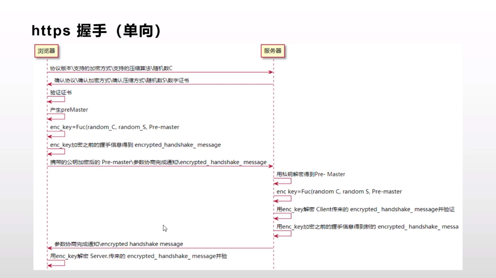

##### https握手

##### 对称加密
* a 请求b的公钥
* a 公钥加密
* b 私钥解密

##### 非对称加密
* a 发送a的公钥给b
* b 用a的公钥加密b的公钥
* b 发送加密好的公钥给a
* a 私钥解密得到b的公钥

[参考链接](https://yq.aliyun.com/articles/494745)

[参考链接](https://blog.csdn.net/u013219814/article/details/56290792)

.jpg)

