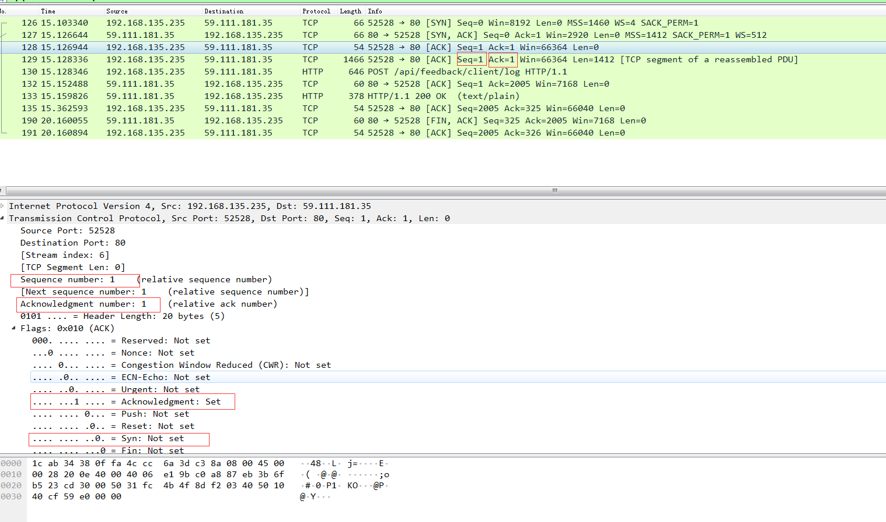

# tcp 协议

[tcp原理参考链接](http://www.ruanyifeng.com/blog/2017/06/tcp-protocol.html)

[tcp原理参考链接](https://www.cnblogs.com/buxiangxin/p/8336022.html)

### tcp三次握手

client -> server
* SYN = 1
* seq = n

server(syn_rec) -> client
* SYN = 1
* ACK = 1
* ack number = n(seq) + 1
* seq = m

client(establish) -> server
* ack number = m(seq) + 1
* ACK = 1

### 发送

* tcp发送过程中，第一个sequence number 一般是1，则next sequence number = sequence number + tcp length

* ack number 代表期待收到下一个数据包的sequence number

* 默认情况下，接收方收到两个TCP数据包，就要发送一个确认信息

* 如果发送方连续收到3个相同的ack number，则代表该包丢失需要重新发送

#### tcp四次挥手

client -> server
* FIN = 1，seq = n

server -> client
* ack number = n(seq) + 1， ACK = 1

> 此处表明client将不在发送数据给server，但是server还能发送数据或者还未发送数据给client，因此还需要两次挥手

server -> client
* FIN = 1，seq = m

client -> server
* ack number = m(seq) + 1， ACK = 1

> 自此整个tcp完全结束

.jpg)

.jpg)

.jpg)

* 数据链路层的最大限度MTU是1500字节
