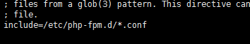
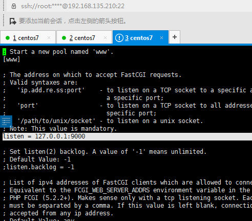
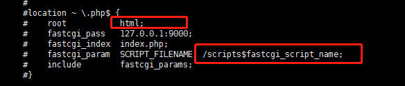
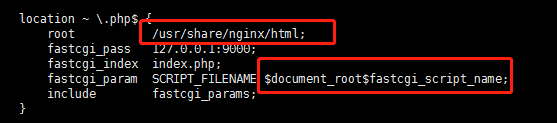
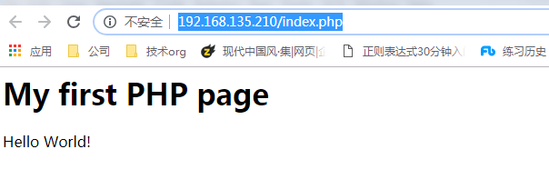
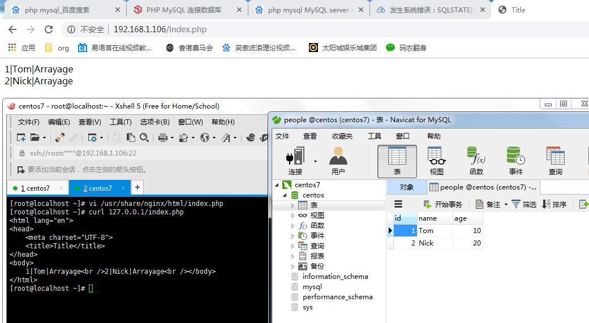

# 第一周：学籍备案以及环境准备

## 个人资料

* 

* 知识星球中的编号: 52183367 

* 常用名: 568

* 联系方式: 382615666(QQ)

* 目前职业: 前端（4年）

* 所在地区: 长沙

* 熟悉的编程语言: javascript

* 自我介绍: 前端，擅长html，css，业余骑行，背包客

## 环境准备

1. 安装虚拟机vmware

2. 虚拟机安装centos 7
    * 判断是否能联网，结果是不能
    ```shell
        service network status
    ```
    * 修改网卡开机启动，并且启动服务
    ```shell
        vi /etc/sysconfig/network-scripts/ifcfg-ens33
        service network restart
    ```
        
3. yum 安装 nginx
    * 配置安装源
    ```shell
        rpm -ivh http://nginx.org/packages/centos/7/noarch/RPMS/nginx-release-centos-7-0.el7.ngx.noarch.rpm
    ```
    * 安装nginx
    ```shell
        yum install -y nginx
    ```
    * 启动nginx
    ```shell
        nginx
    ```
    * 本机查看是否启动，结果是成功的
    ```shell
        curl 127.0.0.1
    ```
    * 宿主机无法访问，由此判断防火墙端口未开放。开放linux防火墙端口
    ```shell
        firewall-cmd --zone=public --add-port=80/tcp --permanent
    ```
    * 重启防火墙，外网访问成功
    ```shell
        service firewalld restart
    ```
    * 开机自动启动
    ```shell
        systemctl enable nginx
    ```
    
4. yum 安装 php-fpm
    * 直接安装
    ```shell
        yum install -y php-fpm
    ```
    * 查看是否安装成功，查看监听端口
    ```shell
        php-fpm
        whereis php-fpm
        cat /etc/php-fpm.conf
    ```
    
    ```shell
        cat /etc/php-fpm.d/www.conf
    ```
    
    * 启动 php-fpm
    ```shell
        service php-fpm start
    ```
    * 开机自动启动
    ```shell
        systemctl enable php-fpm
    ```
    
5. 修改nginx配置
    * 修改nginx配置
    ```shell
        vi /etc/nginx/conf.d/default.conf
    ```
    * 配置php，修改 root fastcgi_param 配置
    
    
    
    
    
    * 重启nginx
    ```shell
        nginx -s reload
    ```
    * 在 /usr/share/nginx/html 创建index.php
    * 在宿主机访问 http://192.168.135.210/index.php
    
    
    
6. 安装mysql
    * 安装mysql
    ```shell
        wget https://repo.mysql.com//mysql80-community-release-el7-3.noarch.rpm
        rpm -ivh ./mysql80-community-release-el7-3.noarch.rpm
        yum install -y mysql-server
    ```
    * 查看初始化密码
    ```shell
        cat /var/log/mysqld.log
    ```
    * 修改密码
    ```mysql
        alter USER 'root'@'localhost' IDENTIFIED BY '_R123oo456t';
    ```
    * 开放3306端口
    ```shell
        firewall-cmd --zone=public --add-port=3306/tcp --permanent
    ```
    * 查看所有用户是否可以远程连接
    ```mysql
        select host, user, authentication_string, plugin from user;
    ```
    * 修改root用户host值，使root用户可以远程登录
    ```mysql
        update user set host = "%" where user='root';
        flush privileges;
    ```
    * navicat 无法连接
    ```mysql
        alter USER 'root'@'%' IDENTIFIED WITH mysql_native_password BY '_R123oo456t';
        flush privileges;
    ```
    * 设置开机启动
    ```shell
        systemctl enable mysqld
    ```
    
7. 编写php代码
    ```php
        <?php
            $con = mysql_connect('localhost', 'root', '_R123oo456t');
            if (!$con) {
                die('Could not connect: ' . mysql_error());
            }
            mysql_select_db('centos', $con);
            $result = mysql_query('select * from people');
            while ($row = mysql_fetch_array($result)) {
                echo $row['id'] . '|' . $row['name'] . '|' . $row.age;
                echo '<br />';
            }
            mysql_close($con);
        ?>
    ```
    * 查询成功
    
    
### 遇到的问题
1. 下载mysql rpm 403
    * 虚拟机网络模式错误，使用的NAT，myql官网将wget 请求识别为爬虫引擎，修改虚拟机网卡为桥接模式
    
2. 宿主机无法请求php
    * 先判断虚拟机能否curl获得响应
    * 不能，则需要查看日志
        * nginx: /etc/log/nginx/xxx.log
        * php-fpm: /etc/log/php-fpm/xxx.log
    * 能，则需要打开防火墙端口，centos 7 的防火墙是firewalld服务
    
3. navicat无法连接数据库
    * 先将防火墙打开端口
    * 修改root用户host值，使root用户可以远程登录
    ```mysql
        update user set host = "%" where user='root';
        flush privileges;
    ```
    * navicat 无法连接
    ```mysql
        alter USER 'root'@'%' IDENTIFIED WITH mysql_native_password BY '_R123oo456t';
        flush privileges;
    ```
4. 虚拟机无法联网
    * 先看网卡是否启动，修改onboot=on，重启网络服务
    
5. php无法连接mysql
    * server_name使用 127.0.0.1 无法连接，后面修改为 localhost 连接成功
    
6. mysql连接未定义
    ```shell
        yum install -y php-mysql
        service php-fpm restart
    ```
    
### 服务器加固
* 查看服务器开放端口，关闭非必要端口
```shell
    firewall-cmd --zone=public --list-ports
    firewall-cmd --zone=public --remove-port=xx/tcp --permanent
```
* 对未经过安全认证的RPM包进行安全检查
```shell
    rpm -qp xxx.rpm --scripts 
```
* 修改账户口令设置
```shell
    vi /etc/login.defs
    
    PASS_MAX_DAYS   99999
    PASS_MIN_DAYS   90
    PASS_MIN_LEN    8
    PASS_WARN_AGE   30
```
* 修改ssh的设置
```shell
    vi /etc/ssh/sshd_config
    
    # ssh 登录端口号
    Port 51866
    # 禁止root ssh远程登录
    PermitRootLogin no
    # 限定用户必须在指定时间内认真成功
    LoginGraceTime 30
    # 登录尝试次数
    MaxAuthTries 3
    # 禁止root登录
    PermitRootLogin no
    # 超时登出
    vi /etc/profile
    export TMOUT=90
    source /etc/profile
    # 查看开机启动服务，禁用不要的服务
    systemctl list-unit-files | grep enabled
```
* 修改nginx配置
```shell
    http {
        # 不允许列出整个目录
        autoindex off;
        # 隐藏nginx版本号
        server_tokens off;
        # 读取header头超时时间
        client_header_timeout 15;
        # 读取body超时时间
        client_body_timeout 15;   
        # 上传文件大小限制
        client_max_body_size 100m;
        # 响应客户端超时时间
        send_timeout    600;
        # 客户端保持会话超时时间
        keepalive_timeout 60;
    }
    server {
        # 禁止访问以下后缀名文件
        location ~.*\.(sql|log|txt|jar|war|sh|py) {
            deny all;
        }
    }
```

### 参考资料
* [CentOS 7使用yum安装Nginx](https://www.centos.bz/2018/01/centos-7%EF%BC%8C%E4%BD%BF%E7%94%A8yum%E5%AE%89%E8%A3%85nginx/)
* [centos 7安装mysql](https://blog.csdn.net/qq_23167527/article/details/85236999)
* [w3school php 教程](https://www.w3school.com.cn/php/php_mysql_connect.asp)
* [菜鸟自学网 php 教程](https://www.runoob.com/php/php-tutorial.html)
* [php mysql_connect连接mysql失败解决方案](https://jingyan.baidu.com/article/37bce2be4c35661003f3a25f.html)
* [127.0.0.1与localhost区别](https://www.zhihu.com/question/23940717)
* [linux安全策略资料传送门](https://www.cnblogs.com/Dev0ps/p/9640319.html)
* [nginx安全策略传送门](https://www.cnblogs.com/shawhe/p/10794487.html)
