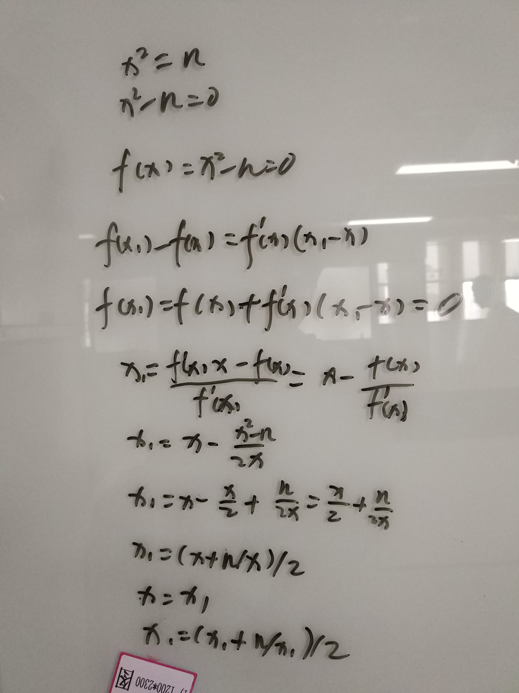

# leetcode


[121. 买卖股票的最佳时机](https://leetcode-cn.com/problems/best-time-to-buy-and-sell-stock/)

>>>
    给定一个数组，它的第 i 个元素是一支给定股票第 i 天的价格。
    
    如果你最多只允许完成一笔交易（即买入和卖出一支股票），设计一个算法来计算你所能获取的最大利润。
    
    注意你不能在买入股票前卖出股票。
    
    示例 1:
    
    输入: [7,1,5,3,6,4]
    输出: 5
    解释: 在第 2 天（股票价格 = 1）的时候买入，在第 5 天（股票价格 = 6）的时候卖出，最大利润 = 6-1 = 5 。
         注意利润不能是 7-1 = 6, 因为卖出价格需要大于买入价格。
>>>

```ecmascript 6
      var maxProfit = function(prices) {
        let min = prices[0]
        let profit = 0
        for (let i = 1; i < prices.length; i++) {
          if (prices[i] < min) {
            min = prices[i]
          } else {
            profit = Math.max(profit, prices[i] - min)
          }
        }
        return profit
      };
```

[119. 杨辉三角 II](https://leetcode-cn.com/problems/pascals-triangle-ii/)

>>>
    在杨辉三角中，每个数是它左上方和右上方的数的和。
    
    示例:
    
    输入: 3
    输出: [1,3,3,1]
>>>

```ecmascript 6
   var getRow = function(rowIndex) {
     rowIndex++
     if (rowIndex === 1) {
       return [1]
     }
     let result = [1]
     for (let i = 1; i < rowIndex; i++) {
       let arr = [1]
       for (let j = 1; j < i; j++) {
         arr[j] = result[j - 1] + result[j]
       }
       arr.push(1)
       result = arr
     }
     return result
   };
```

[118. 杨辉三角](https://leetcode-cn.com/problems/pascals-triangle/)

>>>
    给定一个非负整数 numRows，生成杨辉三角的前 numRows 行。
>>>

```ecmascript 6
      var generate = function(numRows) {
        if (!numRows) {
          return []
        }
        if (numRows === 1) {
          return [[1]]
        }
        let i = 2
        let result = [
          [1],
          [1, 1]
        ]
        while (i < numRows) {
          let arr = [1]
          for (let j = 1; j < result[i - 1].length; j++) {
            arr.push(result[i - 1][j - 1] + result[i - 1][j])
          }
          arr.push(1)
          result.push(arr)
          i++
        }
        return result
      };
```

[112. 路径总和](https://leetcode-cn.com/problems/path-sum/submissions/)

>>>
    给定一个二叉树和一个目标和，判断该树中是否存在根节点到叶子节点的路径，这条路径上所有节点值相加等于目标和。
    
    说明: 叶子节点是指没有子节点的节点。
    
    示例: 
    给定如下二叉树，以及目标和 sum = 22，
>>>

```ecmascript 6
   var hasPathSum = function(root, sum) {
     if (!root) {
       return false
     }
     let arr = [root]
     while (arr.length) {
       let node = arr.pop()
       if (!node.left && !node.right && node.val === sum) {
         return true
       }
       if (node.left) {
         node.left.val += node.val
         arr.push(node.left)
       }
       if (node.right) {
         node.right.val += node.val
         arr.push(node.right)
       }
     }
     return false
   };
   var hasPathSum = function(root, sum) {
     if (!root) {
       return false
     }
     if (!root.left && !root.right && root.val === sum) {
       return true
     }
     return arguments.callee(root.left, sum - root.val) || arguments.callee(root.right, sum - root.val)
   };
```

[111. 二叉树的最小深度](https://leetcode-cn.com/problems/minimum-depth-of-binary-tree/submissions/)

>>>
    给定一个二叉树，找出其最小深度。
    
    最小深度是从根节点到最近叶子节点的最短路径上的节点数量。
    
    说明: 叶子节点是指没有子节点的节点。
    
    示例:
    
    给定二叉树 [3,9,20,null,null,15,7],
>>>

```ecmascript 6
   var minDepth = function(root) {
     if (!root) {
       return 0
     }
     let min = 0
     root.deep = 1
     let arr = [root]
     while (arr.length) {
       let node = arr.pop()
       if (!node.left && !node.right) {
         min = min || node.deep
         min = Math.min(min, node.deep)
       }
       if (node.left) {
         node.left.deep = node.deep + 1
         arr.push(node.left)
       }
       if (node.right) {
         node.right.deep = node.deep + 1
         arr.push(node.right)
       }
     }
     return min
   };
   var minDepth = function(root) {
     if (!root) {
       return 0
     }
     let left = arguments.callee(root.left)
     let right = arguments.callee(root.right)
     return left && right ? Math.min(left, right) + 1 : 1 + left + right
   };
```

[110. 平衡二叉树](https://leetcode-cn.com/problems/balanced-binary-tree/)

>>>
    给定一个二叉树，判断它是否是高度平衡的二叉树。
    
    本题中，一棵高度平衡二叉树定义为：
    
    一个二叉树每个节点 的左右两个子树的高度差的绝对值不超过1。
    
    示例 1:
    
    给定二叉树 [3,9,20,null,null,15,7]
>>>

```ecmascript 6
   var isBalanced = function(root) {
     if (!root) {
       return true
     }
     return  Math.abs(deep(root.left) - deep(root.right)) < 2 && arguments.callee(root.left) && arguments.callee(root.right)
   };
   function deep (root) {
     if (!root) {
       return 0
     }
     return Math.max(arguments.callee(root.left) + 1, arguments.callee(root.right) + 1)
   }
```

[108. 将有序数组转换为二叉搜索树](https://leetcode-cn.com/problems/convert-sorted-array-to-binary-search-tree/)

>>>
    将一个按照升序排列的有序数组，转换为一棵高度平衡二叉搜索树。
    
    本题中，一个高度平衡二叉树是指一个二叉树每个节点 的左右两个子树的高度差的绝对值不超过 1。
>>>

```ecmascript 6
   var sortedArrayToBST = function(nums) {
        return loop(nums, 0, nums.length - 1)
   };
   function loop (nums, start, end) {
     if (start > end) {
       return null
     }
     let mid = Math.trunc(start + (end - start) / 2)
     let root = new TreeNode(nums[mid])
     root.left = arguments.callee(nums, start, mid - 1)
     root.right = arguments.callee(nums, mid + 1, end)
     return root
   }
```

[107. 二叉树的层次遍历 II](https://leetcode-cn.com/problems/binary-tree-level-order-traversal-ii/)

>>>
    给定一个二叉树，返回其节点值自底向上的层次遍历。 （即按从叶子节点所在层到根节点所在的层，逐层从左向右遍历）
    
    例如：
    给定二叉树 [3,9,20,null,null,15,7],
>>>

```ecmascript 6
     var levelOrderBottom = function(root) {
       if (!root) {
         return []
       }
       root.deep = 0
       let result = []
       let arr = [root]
       while (arr.length) {
         let node = arr.pop()
         result[node.deep] = result[node.deep] || []
         result[node.deep].push(node.val)
         if (node.right) {
           node.right.deep = node.deep + 1
           arr.push(node.right)
         }
         if (node.left) {
           node.left.deep = node.deep + 1
           arr.push(node.left)
         }
       }
       return result.reverse()
     };
   
     var levelOrderBottom = function(root) {
       if (!root) {
         return []
       }
       root.deep = 0
       let arr = [[root.val]]
       loop(root, arr)
       return arr.reverse()
     };
     function loop (root, arr) {
       if (root.left || root.right) {
         arr[root.deep + 1] = arr[root.deep + 1] || []
       }
       if (root.left) {
         root.left.deep = root.deep + 1
         arr[root.deep + 1].push(root.left.val)
         arguments.callee(root.left, arr)
       }
       if (root.right) {
         root.right.deep = root.deep + 1
         arr[root.deep + 1].push(root.right.val)
         arguments.callee(root.right, arr)
       }
     }
```

[104. 二叉树的最大深度](https://leetcode-cn.com/problems/maximum-depth-of-binary-tree/)

>>>
    给定一个二叉树，找出其最大深度。
    
    二叉树的深度为根节点到最远叶子节点的最长路径上的节点数。
    
    说明: 叶子节点是指没有子节点的节点。
    
    示例：
    给定二叉树 [3,9,20,null,null,15,7]，
>>>

```ecmascript 6
      var maxDepth = function(root) {
        if (!root) {
          return 0
        }
        return Math.max(arguments.callee(root.left), arguments.callee(root.right)) + 1
      };
   
      var maxDepth = function(root) {
        if (!root) {
          return 0
        }
        let arr = []
        let deep = 1
        root.deep = 1
        arr.push(root)
        while (arr.length) {
          let node = arr.pop()
          deep = Math.max(node.deep, deep)
          if (node.left) {
            node.left.deep = node.deep + 1
            arr.push(node.left)
          }
          if (node.right) {
            node.right.deep = node.deep + 1
            arr.push(node.right)
          }
        }
        return deep
      };
```

[101. 对称二叉树](https://leetcode-cn.com/problems/symmetric-tree/)

>>>
    给定一个二叉树，检查它是否是镜像对称的。
    
    例如，二叉树 [1,2,2,3,4,4,3] 是对称的。
>>>

```ecmascript 6
   var isSymmetric = function(root) {
        return mirror(root, root)
   };
   function mirror (left, right) {
     if (!left && !right) {
       return true
     }
     if (left && !right || !left && right) {
       return false
     }
     return left.val === right.val && arguments.callee(left.left, right.right) && arguments.callee(left.right, right.left)
   }
      var isSymmetric = function(root) {
        let arr = []
        arr.push(root)
        arr.push(root)
        while (arr.length) {
          let node1 = arr.pop()
          let node2 = arr.pop()
          if (!node2 && !node1) {
            continue
          }
          if (!node1 && node2 || node1 && !node2) {
            return false
          }
          if (node1.val !== node2.val) {
            return false
          }
          arr.push(node1.left)
          arr.push(node2.right)
          arr.push(node1.right)
          arr.push(node2.left)
        }
        return true
      };
```

[100. 相同的树](https://leetcode-cn.com/problems/same-tree/submissions/)

>>>
    给定两个二叉树，编写一个函数来检验它们是否相同。
    
    如果两个树在结构上相同，并且节点具有相同的值，则认为它们是相同的。
>>>

```ecmascript 6
                  var isSameTree = function(p, q) {
                    if (!p && !q) {
                      return true
                    }
                    if (p && q && p.val === q.val) {
                      return arguments.callee(p.left, q.left) && arguments.callee(p.right, q.right)
                    }
                    return false
                  };
```

[14. 最长公共前缀](https://leetcode-cn.com/problems/longest-common-prefix/solution/)

>>>
    编写一个函数来查找字符串数组中的最长公共前缀。
    
    如果不存在公共前缀，返回空字符串 ""。
    
    示例 1:
    
    输入: ["flower","flow","flight"]
    输出: "fl"
>>>

```ecmascript 6
                var longestCommonPrefix = function(strs) {
                  if (!strs.length) {
                    return ''
                  }
                  let first = strs[0]
                  let i = first.length - 1
                  let j = 1
                  while (i > -1 && j < strs.length) {
                    if (first[i] === strs[j][i] && first.substring(0, i + 1) === strs[j].substring(0, i + 1)) {
                      j++
                    } else {
                      i--
                    }
                  }
                  return first.substring(0, i + 1) || ''
                };
```

[53. 最大子序和](https://leetcode-cn.com/problems/maximum-subarray/submissions/)

>>>
    给定一个整数数组 nums ，找到一个具有最大和的连续子数组（子数组最少包含一个元素），返回其最大和。
    
    示例:
    
    输入: [-2,1,-3,4,-1,2,1,-5,4],
    输出: 6
    解释: 连续子数组 [4,-1,2,1] 的和最大，为 6。
>>>

```ecmascript 6
              var maxSubArray = function(nums) {
                let sum = nums[0]
                let result = sum
                for (let i = 1; i < nums.length; i++) {
                  sum = Math.max(nums[i], sum + nums[i])
                  result = Math.max(sum, result)
                }
                return result
              };
```

[69. x 的平方根](https://leetcode-cn.com/problems/sqrtx/)

>>>
    实现 int sqrt(int x) 函数。
    
    计算并返回 x 的平方根，其中 x 是非负整数。
    
    由于返回类型是整数，结果只保留整数的部分，小数部分将被舍去。
    
    示例 1:
    
    输入: 4
    输出: 2
>>>

[牛顿迭代法传送门](https://www.cnblogs.com/qlky/p/7735145.html)
[相关知识点传送门](https://blog.csdn.net/ccnt_2012/article/details/81837154)


```ecmascript 6
            var mySqrt = function(x) {
              let i = x
              while (i * i > x) {
                i = (i + x / i) / 2
              }
              return Math.trunc(i)
              // return ~~Math.pow(x, .5)
              // return ~~Math.sqrt(x)
              // return ~~x**.5
            };
```

[83. 删除排序链表中的重复元素](https://leetcode-cn.com/problems/remove-duplicates-from-sorted-list/)

>>>
    给定一个排序链表，删除所有重复的元素，使得每个元素只出现一次。
    
    示例 1:
    
    输入: 1->1->2
    输出: 1->2
>>>

```ecmascript 6
          var deleteDuplicates = function(head) {
            let cur = head
            while(cur && cur.next) {
              if (cur.val === cur.next.val) {
                cur.next = cur.next.next
              } else {
                cur = cur.next
              }
            }
            return head
          };
```

[67. 二进制求和](https://leetcode-cn.com/problems/add-binary/)

>>>
    给定两个二进制字符串，返回他们的和（用二进制表示）。
    
    输入为非空字符串且只包含数字 1 和 0。
    
    示例 1:
    
    输入: a = "11", b = "1"
    输出: "100"
>>>

```ecmascript 6
        var addBinary = function(a, b) {
          let i = a.length - 1
          let j = b.length - 1
          let flag = 0
          let result = ''
      
          while (i >= 0 || j >= 0) {
            let sum = flag
            if (i >= 0) {
              sum = a[i] - 0 + sum
              i--
            }
            if (j >= 0) {
              sum = b[j] - 0 + sum
              j--
            }
            result = sum % 2 + result
            flag = Math.trunc(sum / 2)
          }
          if (flag) {
            result = flag + result
          }
          return result
        };
```

[58. 最后一个单词的长度](https://leetcode-cn.com/problems/length-of-last-word/)

>>>
    给定一个由整数组成的非空数组所表示的非负整数，在该数的基础上加一。
    
    最高位数字存放在数组的首位， 数组中每个元素只存储一个数字。
    
    你可以假设除了整数 0 之外，这个整数不会以零开头。
    
    输入: [1,2,3]
    输出: [1,2,4]
    解释: 输入数组表示数字 123。
>>>

```ecmascript 6
      var plusOne = function(digits) {
        let flag = 1
        for (let i = digits.length - 1; i >= 0; i--) {
          if (digits[i] === 9 && flag) {
            digits[i] = 0
            flag = 1
          } else {
            digits[i] = digits[i] + flag
            flag = 0
            break
          }
        }
        if (flag) {
          digits.unshift(1)
        }
        return digits
      };
```

[58. 最后一个单词的长度](https://leetcode-cn.com/problems/length-of-last-word/)

>>>
    给定一个仅包含大小写字母和空格 ' ' 的字符串，返回其最后一个单词的长度。
    
    如果不存在最后一个单词，请返回 0 。
    
    说明：一个单词是指由字母组成，但不包含任何空格的字符串
>>>

```ecmascript 6
    var lengthOfLastWord = function(s) {
      s = s.trim()
      for (let i = s.length - 1; i >= 0; i--) {
        if (i == 0) {
          return s.length
        }
        if (s[i] === ' ') {
          return s.length - 1 - i
        }
      }
      return 0
    };
```

[38. 报数](https://leetcode-cn.com/problems/count-and-say/)

>>>
    报数序列是一个整数序列，按照其中的整数的顺序进行报数，得到下一个数。其前五项如下：
    
    1.     1
    2.     11
    3.     21
    4.     1211
    5.     111221
>>>

```ecmascript 6
  var countAndSay = function(n) {
    let str = '1'
    let len = 1
    let temp = ''
    for (let j = 1; j < n; j++) {
      temp = ''
      for (let i = 0; i < str.length; i++) {
        if (str[i] === str[i+1]) {
          len++
        } else {
          temp += `${len}${str[i]}`
          len = 1
        }
      }
      str = temp
    }
    return str
  };
```

[35. 搜索插入位置](https://leetcode-cn.com/problems/search-insert-position/submissions/)

>>>
    给定一个排序数组和一个目标值，在数组中找到目标值，并返回其索引。如果目标值不存在于数组中，返回它将会被按顺序插入的位置。
    
    你可以假设数组中无重复元素。
>>>

```ecmascript 6
  var searchInsert = function(nums, target) {
      if (nums[nums.length - 1] < target) {
        return nums.length
      }
      for(let i = 0; i < nums.length; i++) {
        if (nums[i] >= target){
          return i
        }
      }
      // return nums.length
    };
```

[28. 实现strStr()](https://leetcode-cn.com/problems/implement-strstr/submissions/)

>>>
    给定一个 haystack 字符串和一个 needle 字符串，在 haystack 字符串中找出 needle 字符串出现的第一个位置 (从0开始)。如果不存在，则返回  -1。
>>>

```ecmascript 6
  // kmp 算法
  var strStr = function(haystack, needle) {
    if (!needle) {
      return 0
    }
    let j = 0
    for (let i = 0; i <= haystack.length; i++) {
      if (j === needle.length) {
        return i - j
      }
      if (haystack[i] === needle[j]) {
        j++
      } else {
        i = i - j
        j = 0
      }
    }
    return -1
  };
```

[26. 删除排序数组中的重复项](https://leetcode-cn.com/problems/remove-duplicates-from-sorted-array/submissions/)

>>>
    给定一个排序数组，你需要在原地删除重复出现的元素，使得每个元素只出现一次，返回移除后数组的新长度。
    
    不要使用额外的数组空间，你必须在原地修改输入数组并在使用 O(1) 额外空间的条件下完成。 
>>>

```ecmascript 6
    var removeDuplicates = function(nums) {
      let i = 0
      for (let j = 0; j <nums.length; j++) {
        if (nums[i] !== nums[j]) {
          i++
          nums[i] = nums[j]
        }
      }
      return i + 1
    };
```

[21. 合并两个有序链表](https://leetcode-cn.com/problems/merge-two-sorted-lists/submissions/)

>>>
    将两个有序链表合并为一个新的有序链表并返回。新链表是通过拼接给定的两个链表的所有节点组成的。 
>>>

```ecmascript 6
  var mergeTwoLists = function(l1, l2) {
      let root = new ListNode()
      let current = root
      while (l1 && l2) {
        if (l1.val < l2.val) {
          current.next = l1
          l1 = l1.next
        } else {
          current.next = l2
          l2 = l2.next
        }
        current = current.next
      }
      current.next = l1 || l2
      return root.next
    };
    
    var mergeTwoLists = function(l1, l2) {
      if (!l1 || !l2) {
        return null
      }
      if (l1.val < l2.val) {
        l1.next = mergeTwoLists(l1.next, l2)
        return l1
      } else {
        l2.next = mergeTwoLists(l1, l2.next)
        return l2
      }
    };
```

[20. 有效的括号](https://leetcode-cn.com/problems/valid-parentheses/submissions/)

>>>
    给定一个只包括 '('，')'，'{'，'}'，'['，']' 的字符串，判断字符串是否有效。
>>>

```ecmascript 6
  var isValid = function(s) {
    const dictionaries = {
      '(': -3,
      '{': -2,
      '[': -1,
      ']': 1,
      '}': 2,
      ')': 3,
    }
    let result = []
    for (let i = 0; i < s.length; i++) {
      if (s[i] in dictionaries) {
        if (dictionaries[s[i]] < 0) {
          result.push(dictionaries[s[i]])
        } else {
          if (-result.pop() !== dictionaries[s[i]]) {
            return false
          }
        }
      }
    }
    return !result.length
  };
```


[13. 罗马数字转整数](https://leetcode-cn.com/problems/roman-to-integer/)

>>>
    罗马数字包含以下七种字符: I， V， X， L，C，D 和 M。
>>>

```ecmascript 6
    var romanToInt = function(s) {
      const dictionaries = {
        'I': 1,
        'V': 5,
        'X': 10,
        'L': 50,
        'C': 100,
        'D': 500,
        'M': 1000
      }
      let result = 0
      for(let i = 0; i < s.length; i++) {
        result += dictionaries[s[i]] * (dictionaries[s[i]] < dictionaries[s[i + 1]] ? -1 : 1)
      }
      return result
    };
```


[9. 回文数](https://leetcode-cn.com/problems/palindrome-number/)

>>>
    判断一个整数是否是回文数。回文数是指正序（从左向右）和倒序（从右向左）读都是一样的整数。
>>>

```ecmascript 6
  var isPalindrome = function(x) {
    let result = 0
    if (x < 0 || x % 10 === 0 && x !== 0) {
      return false
    }
    while (x > result) {
      result = result * 10 + x % 10
      x = ~~(x / 10)
    }
    return result === x || x === ~~(result / 10)
    // return x.toString().split('').reverse().join('') === x.toString()
  };
  // 每次循环剥掉数字两端   12321 => 232
  var isPalindrome = function(x) {
      if (x < 0) {
        return false;
      }
      let len = 1;
      while (x / len > 10) {
        len *= 10;
      }
      while (x > 0) {
        let left = Math.trunc(x / len);
        let right = x % 10;

        if (left !== right) {
          return false;
        } else {
          x = Math.trunc((x % len) / 10);
          len /= 100;
        }
      }
      return true;
    };
```

[7. 整数反转](https://leetcode-cn.com/problems/reverse-integer/)

>>>
    给出一个 32 位的有符号整数，你需要将这个整数中每位上的数字进行反转。
>>>

```ecmascript 6
  var reverse = function(x) {
    const min_value = -Math.pow(2, 31)
    // const min_value = 1 << 31
    const max_value = Math.pow(2, 31) - 1
    // const max_value = ~min_value
    let result = 0
    if (x > max_value || x < min_value) {
      return result
    }
    while (x) {
      result = result * 10 + x % 10
      x = parseInt(x / 10)
    }
    if (result > max_value || result < min_value) {
      result = 0
    }
    return result
  };
```
> 可以将所有的负数转换为正数


[1. 两数之和](https://leetcode-cn.com/problems/two-sum/submissions/)

>>>
    给定一个整数数组 nums 和一个目标值 target，请你在该数组中找出和为目标值的那 两个 整数，并返回他们的数组下标。
    你可以假设每种输入只会对应一个答案。但是，你不能重复利用这个数组中同样的元素。
>>>

```ecmascript 6
  var twoSum = function(nums, target) {
      const map = {}
      for (let i = 0; i < nums.length; i++) {
        map[target - nums[i]] = i
        if (nums[i + 1] in map) {
          return [i + 1, map[nums[i + 1]]]
        }
      }
    };
```
